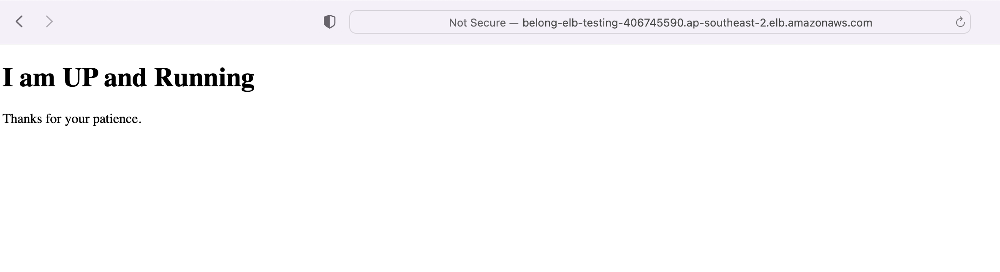

# Requirements

- A dedicated VPC with public and private subnets.

- A server in the private subnet running httpd as a service. The time zone of the server
should be set to AEST.

- Download the file index.html from S3 Bucket (belong-test) in Sydney
region and service it through httpd running as a service on the server.

- Developers require terminal access to the server for further configuration / administration. 

## Solution

This terraform code

- provisions a VPC with public and private subnets
- provisions required amount of servers in private subnets by using launch template and
- places them in autoscaling group behind an application load balancer. 
- attaches instance profile to servers that contains the AWS managed policies AmazonSSMManagedInstanceCore and AmazonS3ReadOnlyAccess
- refer [variables.tf](variables.tf) files for required and optional parameters
- This code has been tested using the config file for [testing](config/testing/testing.tfvars) stage 




## Prerequisites
- A s3 bucket in Sydney region with index.html file. Update [user_data.sh] (scripts/user_data.sh)
- A s3 bucket and dynamoDB table store and manage terraform state. Update [<state>-backend.tfvars](config/testing/testing-backend.tfvars)
- SSM agent pre-installed on EC2
- Install terraform (v1.4.5 and above)

## Usage
```sh
export stage=testing
terraform init -backend-config=config/${stage}/${stage}-backend.tfvars
terraform plan -var-file=config/${stage}/${stage}.tfvars
terraform apply -var-file=config/${stage}/${stage}.tfvars -auto-approve
```
It outputs the The DNS name of the load balancer, which you can hit to confirm server is serving the html page. 

## How to access server
- access via AWS console : Select the ec2 instance and press connect in session manager tab
- or follow these [instructions](https://github.com/qoomon/aws-ssm-ec2-proxy-command/tree/master) to open an SSH connection to the ec2 instances via AWS SSM without the need to open any ssh port in you security groups.

## What is remaining to make it production ready

 A LOT :)

 - Regiser the domain
 - Create a SSL certificate 
 - update listner rule to redirect traffic to port 443
 - create cloudfront distribution
 - create route53 record to direct traffic to ALB via cloudfront distribution
 - assiciate cloudfront deistribtion with WAF to protect against common atacks
 - enable ALB accesslogs 
 - tune autoscaling based on anticipated production load
 - Use hardened AMI 
 - Use vetted terraform modules where possible. 
 - setup monitoring and alerting  